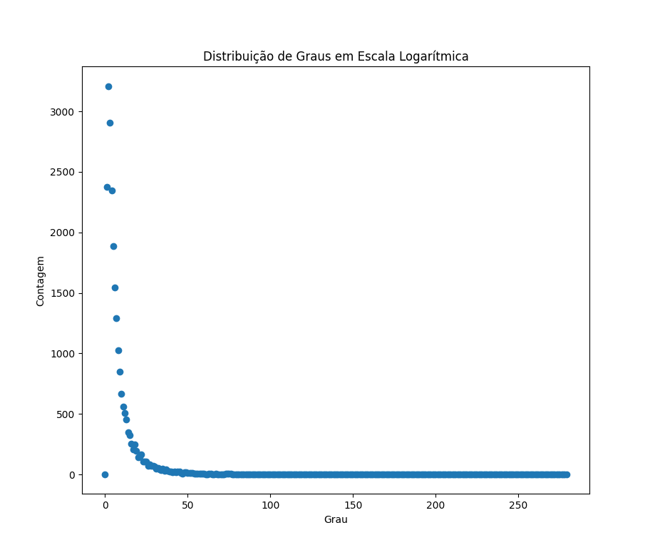
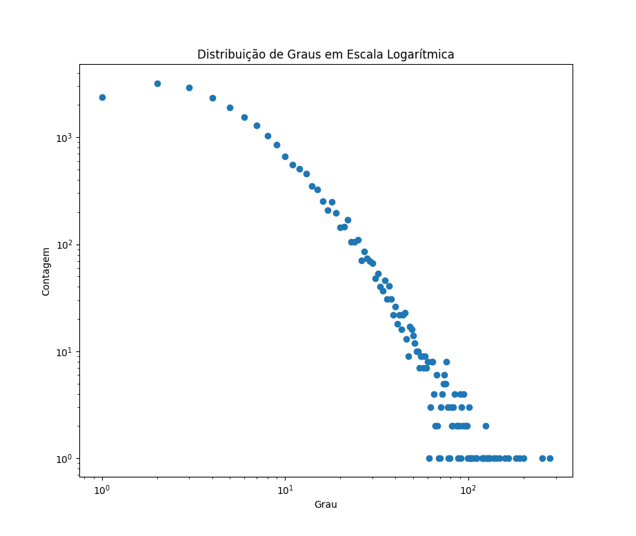
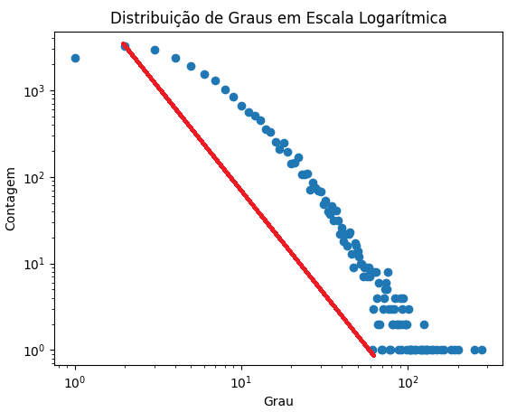
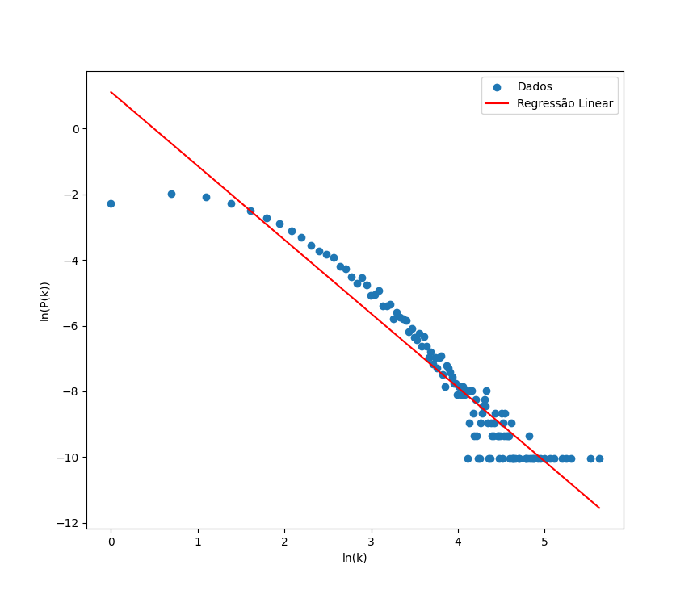

# Estimando Leis de Potência

## **[Rede de colaborações científicas na área de matéria condensada entre 1993 e 2003](http://networksciencebook.com/translations/en/resources/data.html)**

1. **Plote em escala normal e escala log-log a distribuição de grau da rede (desprezando vértices de grau 0). Qual delas é mais adequada para estimar o valor de γ? Por quê?**
   A distribuição de graus em log é mais adequada pois permite visualizar melhor a distribuição de graus em grandes redes. Em redes pequenas, a distribuição de graus pode ser plotada em escala normal e ainda ser legível. No entanto, em redes grandes, a distribuição de graus tende a ser muito dispersa, o que pode dificultar a visualização de padrões.
   - Escala normal:
     
   - Escala log:
     
2. **De posse desse plot, estime superficialmente o valor de γ interpolando os dados por uma linha reta. Qual é a inclinação da linha reta que você traçou? A partir desta inclinação, qual é o valor estimado de γ?**
   Para a obtenção dos valores, o gráfico foi ampliado.
   - **Cateto A (amplitude do eixo da contagem):** 3200-1 = 3.199
   - **Cateto B (amplitude do eixo do grau):** 61-2 = 599
   - **Hipotenusa:** _aproximadamente_ 3.199,54
   - **Seno do ângulo:** _aproximadamente 1,00_
   - **Valor estimado de gama:** _aproximadamente_ **1,55**
   - 
3. Repita os itens 1 e 2, mas utilizando a distribuição de grau cumulativa (lembrete: na distribuição cumulativa de uma variável aleatória X, o eixo y contém P[X ≥ x] em vez de P[X = x]). Qual é a inclinação da linha reta traçada nesse caso? Qual é o valor estimado de γ?
   - **Índice de lei de potência (gamma):** _aproximadamente_ **2,25
     **
