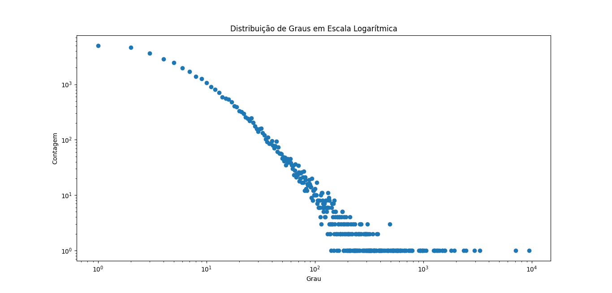

# Métricas Básicas

## **[Rede social de desenvolvedores no GitHub](https://snap.stanford.edu/data/github-social.html)**

- Número de nós: 37700
- Número de arestas: 289003
- Densidade: 0.0004
- Grau médio: 15.3317
- Quantidade de componentes conexas: 1
- Quantidade de nós na maior componente conexa: 37700
- Tamanho médio de componentes isoladas: Não possui componentes isoladas!
- Coeficiente de clusterização do Grafo: 0.1675
- Distribuição de graus:
  
